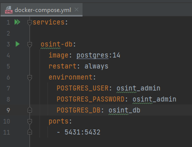
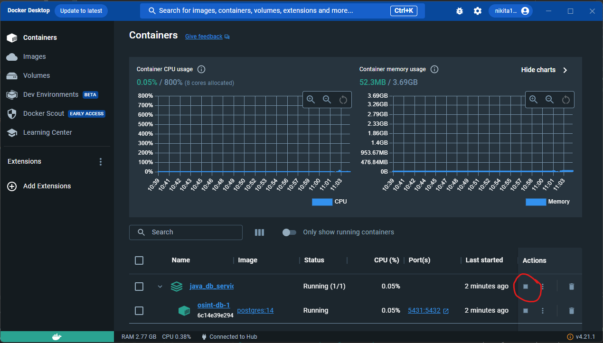
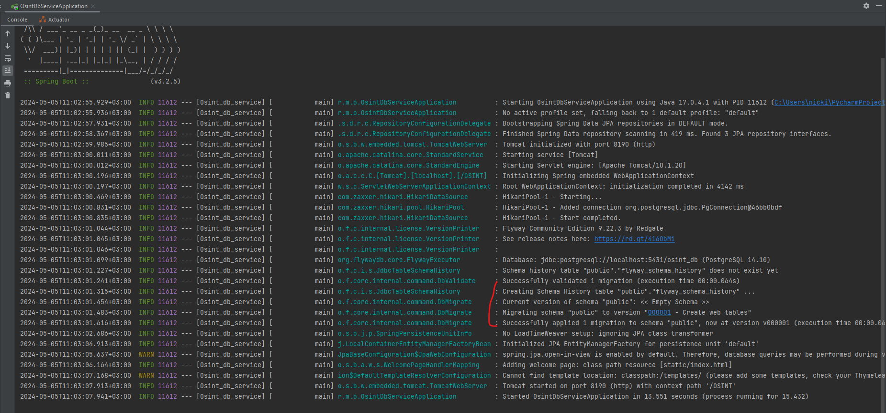

# Инструкция
 
### Ссылка на начальную страницу
http://localhost:8190/OSINT/index.html#!/

## Работа с БД

### Установка Docker:
1. Скачайте и установить Docker Desktop на ваш компьютер
https://www.docker.com/products/docker-desktop/
2. Запустите Docker Desktop. Для этого достаточно открыть приложение Docker Desktop.

### Запуск СУБД Postgres в контейнере
1. Откройте файл docker-compose.yml в intellij idea и запустите его нажав на зеленую кнопку play в файле



2. (Альтернативный) Если кнопки play нет при открытии файла docker-compose.yml запустите файл вручную набрав в терминале команду 
> docker compose up

Отлично, теперь СУБД развернута в контейнере на вашей машине на порту 5431. 
Для остановки контейнера зайдите в приложение Docker Desktop.



### Миграция БД Flyway
#### Скрипты миграции 

Скрипты создания таблиц БД запускаются отдельно при старте java приложения. 
Чтобы Ваши скрипты были запущены при запуске приложения их необходимо добавить в папку ```src/main/resources/db/migration/```
Название скрипта должно соответствовать следующим требованиям:
1. Первая буква V
2. Далее 6 цифр. Цифры в скриптах должны идти по порядку
3. Далее 2 знака нижнего подчеркивания
4. Далее название скрипта в свободной форме на английском языке

#### Запуск приложения
Для запуска скриптов миграции необходимо запустить java приложение
```src/main/java/ru/mipt/osint_db_service/OsintDbServiceApplication.java```

После запуска в логах можно увидеть отчет об успешном развороте скриптов



## Визуализация на фронте
Для отображения на фронте вкладки по своим найденным адресам необходимо повторить те же классы для и для web адресов:
1. Создать классы с моделью данных ```src/main/java/ru/mipt/osint_db_service/model```
2. Создать классы репозитория для работы с моделью в БД ```src/main/java/ru/mipt/osint_db_service/repository```
3. Создать сервис для работы с репозиторием ```src/main/java/ru/mipt/osint_db_service/service```
4. Создать отдельный контроллер для предоставления API ```src/main/java/ru/mipt/osint_db_service/controller```
5. Создать отдельную вкладку на фронте для визуализации БД ```src/main/resources/static```